# Domisoft - Plataforma de Delivery 🚀

Una moderna plataforma de delivery construida con Laravel, Livewire y Tailwind CSS, diseñada para ofrecer una experiencia de usuario excepcional tanto para clientes como administradores.

## 📸 Capturas de Pantalla

### 🎨 Página Principal

#### Hero Section con Partículas Animadas
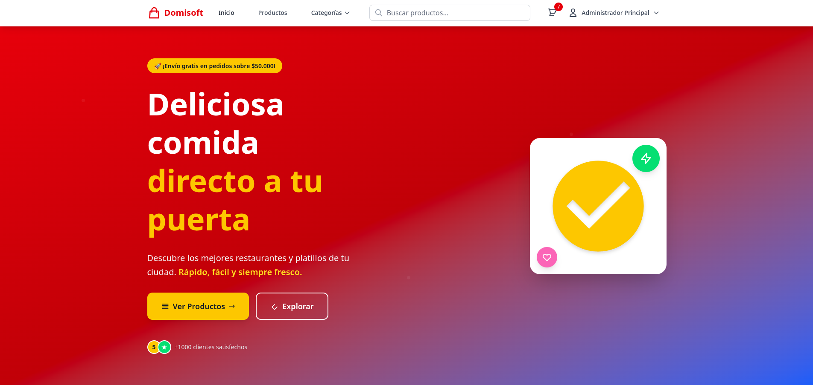
*Hero section con partículas animadas, gradientes atractivos y elementos flotantes*

#### Sección de Estadísticas
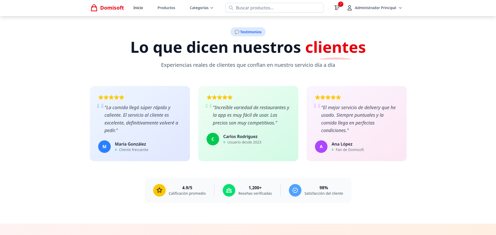
*Contadores animados que se activan al hacer scroll*

#### Productos Destacados
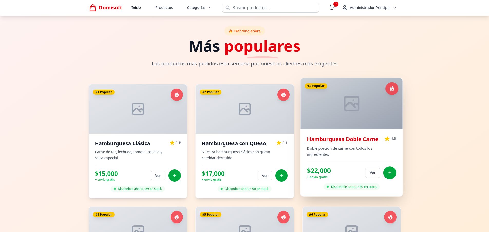
*Cards 3D con ratings, wishlist y vista rápida*

#### Checkout
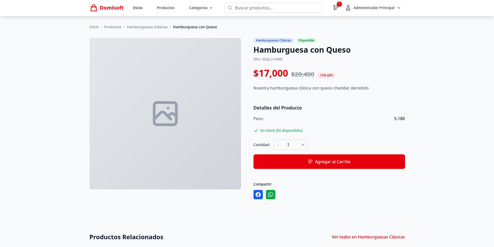
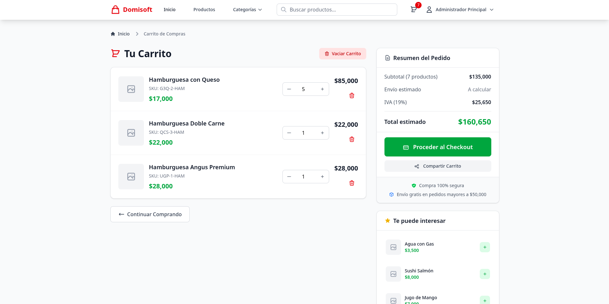
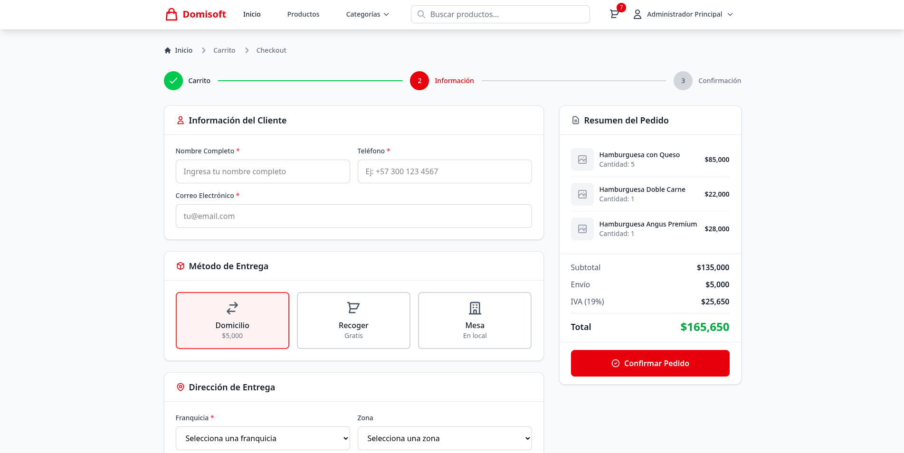


### 👨‍💼 Panel de Administración
- **11-admin-dashboard.png** - Dashboard principal con métricas
- **12-admin-products-management.png** - Gestión de productos
- **13-admin-orders-management.png** - Gestión de pedidos
- **14-admin-categories-management.png** - Administración de categorías
- **15-admin-franchises.png** - Sistema de franquicias

#### Dashboard
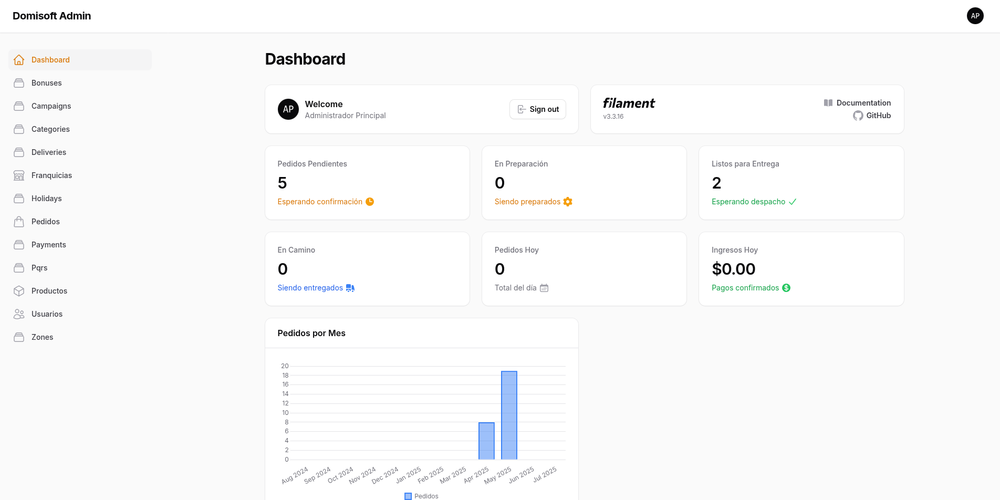

#### Pedidos
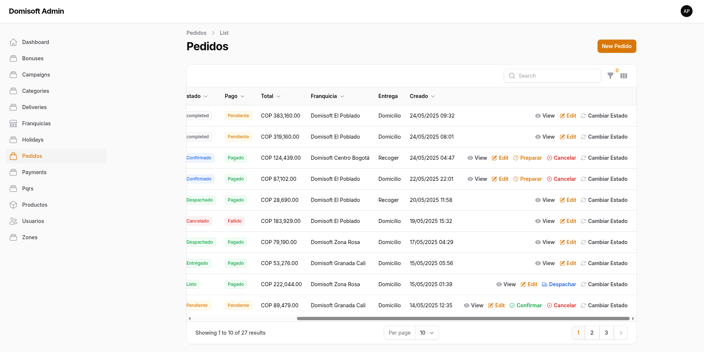
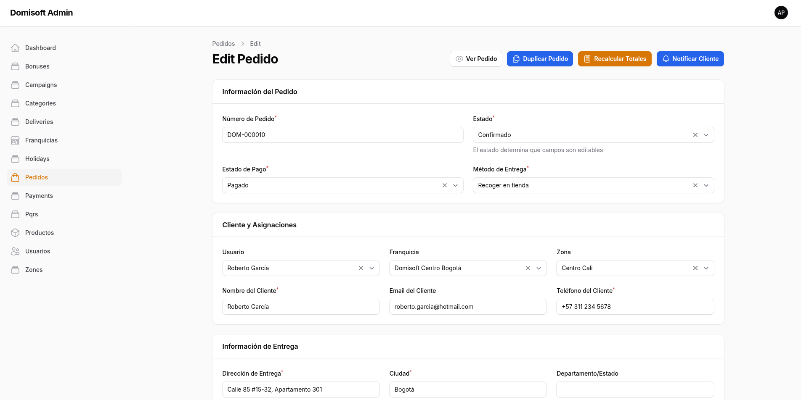
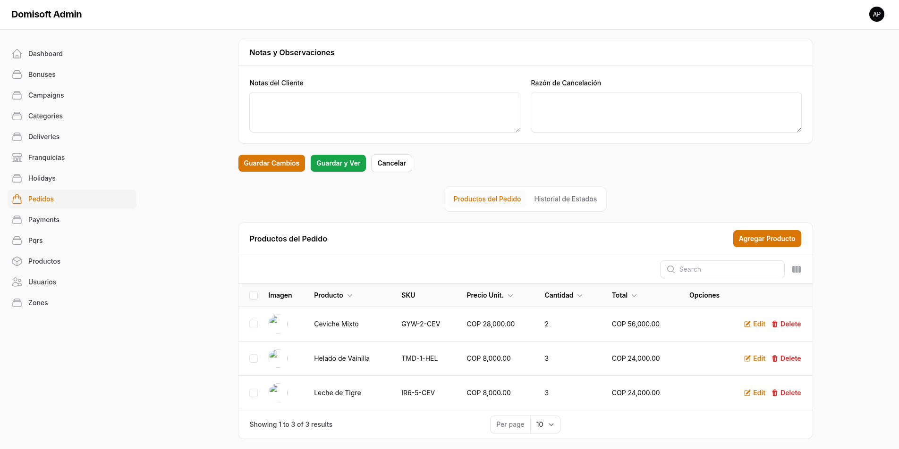

#### Usuarios
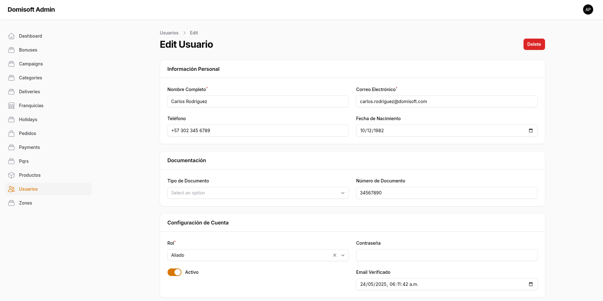

### Pasos de Instalación

1. **Clonar el repositorio**
```bash
git clone https://github.com/tu-usuario/domisoft.git
cd domisoft
```

2. **Instalar dependencias PHP**
```bash
composer install
```

3. **Instalar dependencias JavaScript**
```bash
npm install
```

4. **Configurar variables de entorno**
```bash
cp .env.example .env
php artisan key:generate
```

5. **Configurar base de datos**
```bash
# Editar .env con tu configuración de BD
php artisan migrate --seed
```

6. **Compilar assets**
```bash
npm run dev
# Para producción: npm run build
```

7. **Crear usuario administrador**
```bash
php artisan make:filament-user
```

8. **Iniciar servidor de desarrollo**
```bash
php artisan serve
```

## 🔧 Estructura del Proyecto

```
domisoft/
├── app/
│   ├── Filament/           # Panel de administración
│   ├── Http/Controllers/   # Controladores de la tienda
│   ├── Models/            # Modelos Eloquent
│   └── Providers/         # Service Providers
├── resources/
│   ├── css/               # Estilos Tailwind y custom
│   ├── js/                # JavaScript modular
│   └── views/
│       ├── layouts/       # Layouts base
│       └── store/         # Vistas de la tienda
├── database/
│   ├── migrations/        # Migraciones de BD
│   └── seeders/          # Datos de prueba
└── public/               # Assets compilados
```

## 🎯 Mejoras Implementadas

### Performance
- ✅ Optimización de consultas a BD
- ✅ Caching inteligente
- ✅ Compresión de imágenes
- ✅ Minificación de CSS/JS
- ✅ Lazy loading implementado

### SEO
- ✅ Meta tags dinámicos
- ✅ URLs amigables
- ✅ Schema markup
- ✅ Sitemap automático
- ✅ Open Graph tags

### Seguridad
- ✅ CSRF protection
- ✅ SQL injection prevention
- ✅ XSS protection
- ✅ Rate limiting
- ✅ Input validation

## 📈 Roadmap

### Próximas Características
- [ ] PWA (Progressive Web App)
- [ ] Notificaciones push
- [ ] Chat en tiempo real
- [ ] Sistema de reviews
- [ ] Integración con mapas
- [ ] Pagos online
- [ ] Multi-idioma
- [ ] Dark mode

## 🤝 Contribuir

Las contribuciones son bienvenidas. Por favor:

1. Fork el proyecto
2. Crea una branch para tu feature (`git checkout -b feature/AmazingFeature`)
3. Commit tus cambios (`git commit -m 'Add some AmazingFeature'`)
4. Push a la branch (`git push origin feature/AmazingFeature`)
5. Abre un Pull Request


---

⭐ **¡No olvides dar una estrella si te gustó el proyecto!** ⭐
